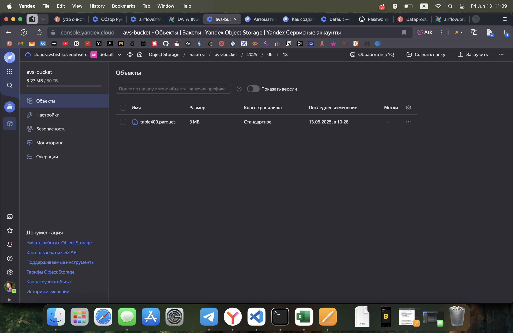
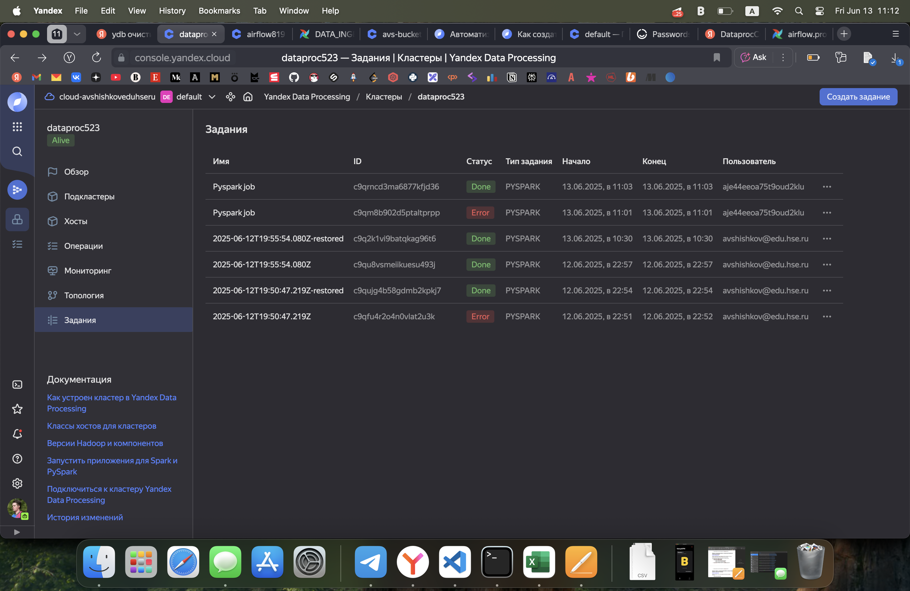
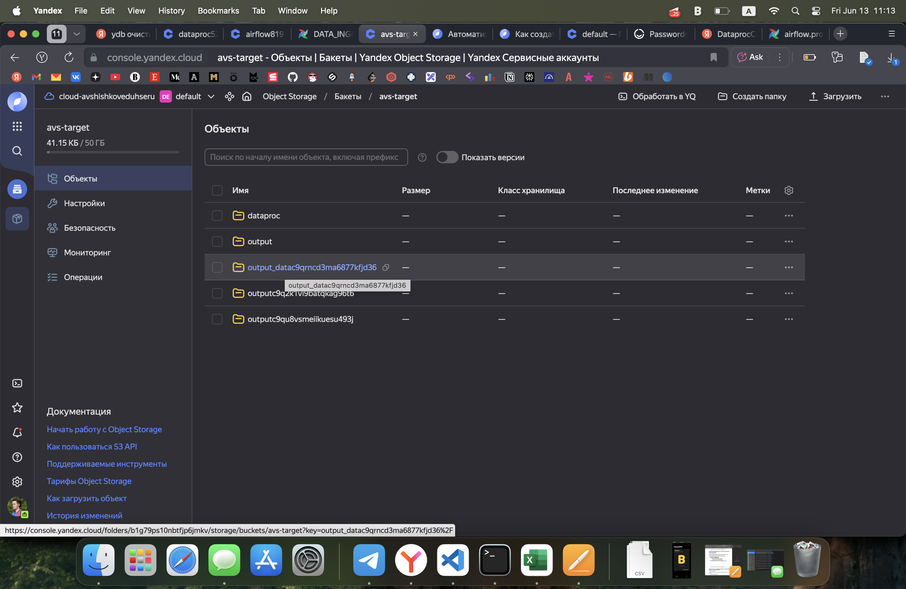
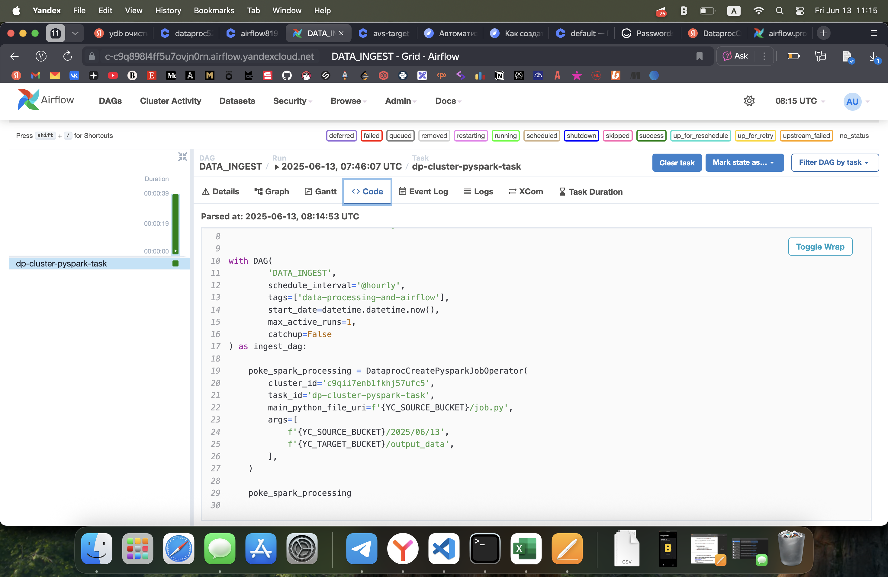
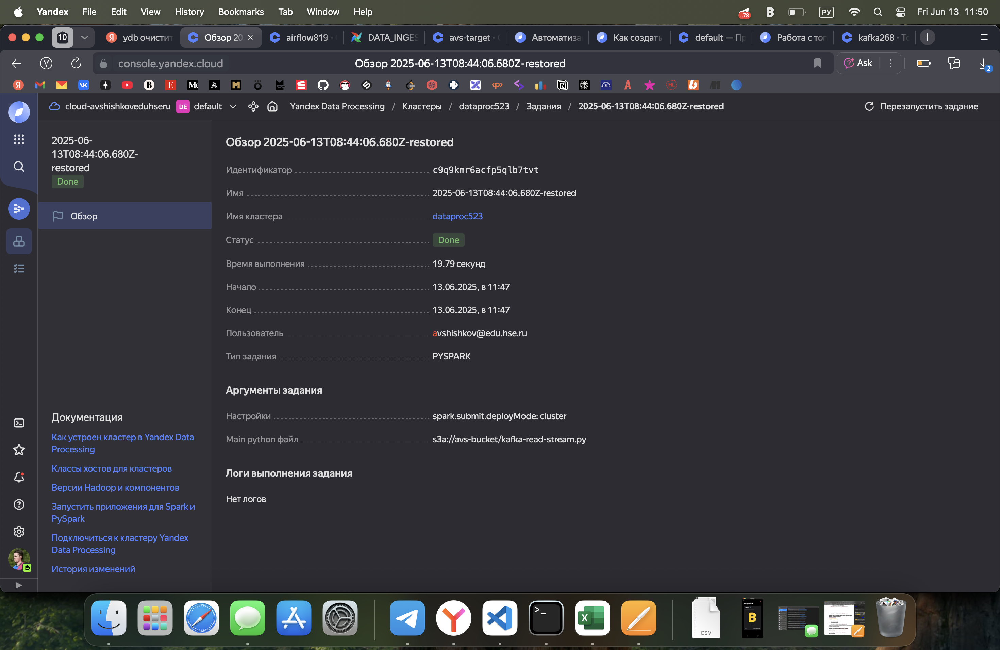
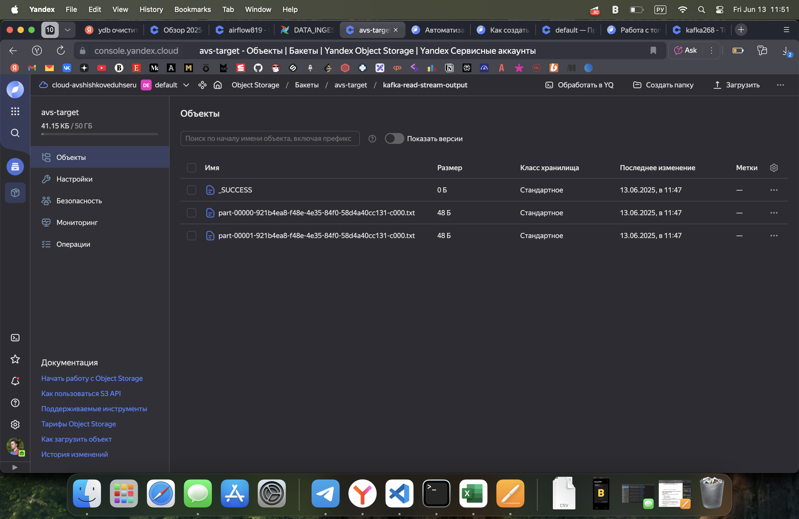

## Описание

- **task_1/credit_scoring_sample.csv** — пример данных для скоринга кредитов.
- **task_1/ydb_connection.txt** — инструкции и параметры для подключения и импорта данных в Yandex Database (YDB).
- **task_2/dag.py** — DAG для Apache Airflow, который запускает PySpark job на Yandex DataProc.
- **task_2/job.py** — PySpark скрипт для обработки данных: читает parquet-файл, группирует по возрасту, сохраняет результат в S3 или HDFS.
- **task_3/kafka-write.py** — PySpark скрипт для записи данных в Kafka.
- **task_3/kafka-read-stream.py** — PySpark скрипт для потоковой обработки данных из Kafka.
## Как запустить

### 1. Импорт данных в YDB

Следуйте инструкциям в [task_1/ydb_connection.txt](task_1/ydb_connection.txt) для создания токена и импорта данных:

```sh
yc iam create-token > iam-token.txt

ydb \
 --endpoint grpcs://ydb.serverless.yandexcloud.net:2135 \
 --database /ru-central1/b1gtt25blltlm3lce53p/etn321n1bs1b81ednv2b \
 --iam-token-file [iam-token.txt](http://_vscodecontentref_/3) \
 import file csv \
 --path table400 \
 --delimiter "," \
 --skip-rows 1 \
 --null-value "" \
 [credit_scoring_sample.csv](http://_vscodecontentref_/4)
```

### 2. Создание Yandex Data Transger

В качестве источника указываем YDB, а в качестве приемника бакет S3

Результат работы


### 3. Запуск PySpark job
Скрипт [task_2/job.py](task_2/job.py) принимает два аргумента: входную и выходную директории (например, S3-пути)

### 4. Автоматизация через Airflow
DAG [task_2/dag.py](task_2/dag.py) автоматически запускает PySpark job на DataProc кластере Yandex.Cloud. 

Основные параметры:
<li> main_python_file_uri — путь к скрипту job.py в S3.
<li> args — входная и выходная директории.

DAG можно импортировать в Airflow и активировать для автоматического запуска по расписанию (@hourly).

Скриншот запуска задания напрямую и через Airflow


Выходные файлы на S3


DAG


### 5. Чтение сообщений из Kafka и запись в S3 с помощью PySpark

Скрипт [`kafka-read-stream.py`](task_3/kafka-read-stream.py) предназначен для чтения сообщений из Kafka-топика с помощью PySpark Structured Streaming и сохранения их в указанный S3-бакет.

Скриншот отработавшего задания


Скриншот результата в бакете

